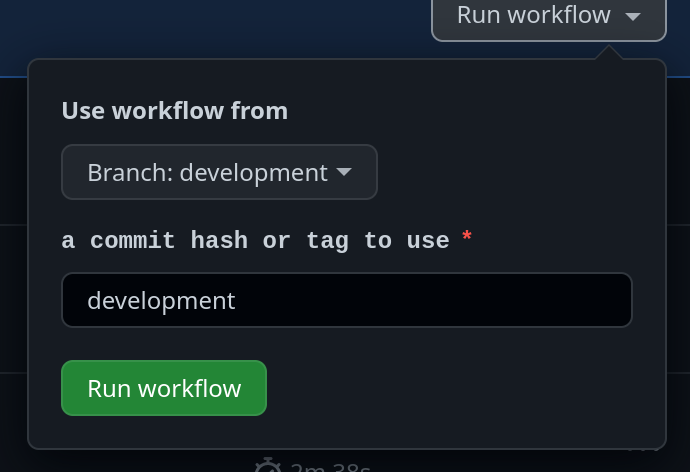

Deploying to Staging or Production
==================================

There are a few steps to deployment.

## Step 1 -- Release Updated Docker Images

You can update the images using this github action.

https://github.com/infinite-industries/infinite/actions/workflows/publish-to-docker-hub.yml

Typically, for a staging release you will use the `development` branch. For production, we will release master.

*Usually the "Use workflow from" will be the same as the "commit or tag to use" field. The only reason this might very is
if you are testing changes to the github actions its self.*

Run the action.  When complete a new versions of the images tagged with the hash/git tag should be available on ghcr.io

* [infinite-industries/web-portal](https://ghcr.io/infinite-industries/web-portal) - the frontend image
* [infinite-industries/api-server](https://ghcr.io/infinite-industries/api-server) - the backend image

## Step 2 -- Update The Servers to Use the New Images

**This requires that you have access to the target server through ssh-key authentication.**

From the root of this project, run:

`./deploy.sh <environment[staging|production]>`

* This will ssh into the server, fetch new images for docker-compose and restart the stack. There will be a short period
of downtime (~1 minute)*

## Initial Server Setup / Infrastructure

### Infrastructure

Our infrastructure currently lives on Azure. We did not use an infrastructure as code solution. The current infrastructure
is fairly simple consisting of

1. Virtual Private Server -- Staging
   1. We pause this when not in use
2. Virtual Private Server -- Prod
3. Hosted Postgres Database Server
   1. Contains Prod and Staging as separate databases under a single hosted instance
4. S3 Bucket (in AWS)

Changing this is a manual process using the Azure dashboard.

### Server Runtime Configuration

The staging and production servers were provisioned using the [ansible files in this project](./ansible). This installs
docker-compose and other runtime dependencies including nginx. If you need to change nginx configuration or other runtime
concerns on the server this is the place to do it. There is a [readme in that directory with more information](./ansible/README.md)

For the most part we try to keep the server runtime fairly spartan. It primarily consists of:

 1. docker/docker-compose
 2. nginx
 3. letsencrypt

### Trouble Shooting Github Action

You can use the github cli to test these out before are added to main.

example: `gh workflow run "publish-to-docker-hub.yml" --ref publish-to-docker-hub -f commit=publish-to-docker-hub`
