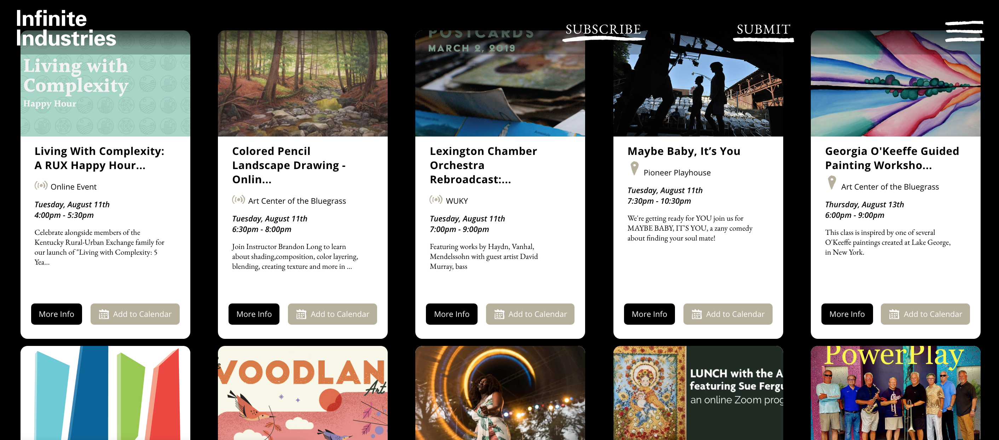

# Infinite Industries

## Mission Statement

Infinite Industries makes experimental contemporary culture more accessible to everyone. Our digital platform and open-source tools highlight cultural events and experiences so more of us can discover, share and participate in them.

<b>why the name?</b>
Artists constantly evolve, inventing new genres and redefining their methods. The processes and mediums of the past aren’t always sufficient for the challenges of the future. We can thank artists for an infinity of possibilities. Production trends organize beneath the umbrella term "industry," creating an infinity of industries and our special name ;)

Our efforts are currently focused on Lexington, Kentucky USA with lots of future plans for world domination.

## Project Components
### API
<a href="https://github.com/infinite-industries/infinite/tree/master/api-server">API Documentation</a>
### Web Portal
<a href="https://github.com/infinite-industries/infinite/tree/master/web-portal">Web Portal Documentation</a>
### Widget
<a href="https://github.com/infinite-industries/infinite/tree/master/widget">Widget Documentation</a>
## Contributing to Infinite Industries
Please contact us at info@infiniteindustries

## Current Project Team Members
+ Matthew
+ Chris
+ Dima

Past Contributors
+ Evan
+ Eugene

## License

MIT
