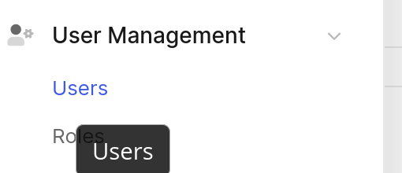
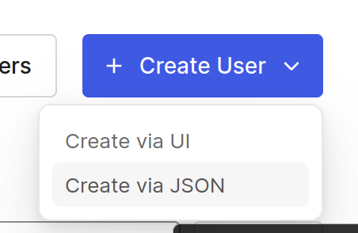

# Onboarding New Partners
## Step 1 -- Upload logos to S3

This assumes you've [installed the aws-cli](https://docs.aws.amazon.com/cli/latest/userguide/getting-started-install.html).
You'll need to upload two versions, one with dark text for light backgrounds and one with light text for dark backgrounds.
```bash
AWS_ACCESS_KEY_ID='your_access_key_here' AWS_SECRET_ACCESS_KEY='your_secret_key_here' AWS_DEFAULT_REGION=us-west-2 aws s3 cp ~/example_black.png s3://infinite-industries-event-images/example_black.png

AWS_ACCESS_KEY_ID='your_access_key_here' AWS_SECRET_ACCESS_KEY='your_secret_key_here' AWS_DEFAULT_REGION=us-west-2 aws s3 cp ~/example_white.png s3://infinite-industries-event-images/example_white.png
```

To verify the upload:
https://infinite-industries-event-images.s3.us-west-2.amazonaws.com/example_white.png

## Step 2 -- Create a user in Auth0

https://manage.auth0.com/dashboard/us/1nfinite/

The Infinite tenant should be selected in the upper right-hand corner


Navigate to User Management/users in the left-hand side navigation menu


Click Create User, then Create via JSON in the upper right corner


Provide the following fields:

```json
{
  "email": "example@example.com",
  "password": "super-secret-password",
  "email_verified": true,
  "app_metadata": {},
  "user_metadata": {}
}
```

## Step 3 -- Login as the User

This one is easy, just login to infinite.industries with the newly created email/password.

## Step 4 -- Create Partner and Association on the Database

### Connect to the Prod Database

Because we restrict database connections to just a few IP addresses, the easiest way to access the prod database
is through an SSH tunnel.

* You will need access to the repository https://github.com/chriswininger/infinite-prod-bk-folder/.
* You will also need to have your public key added to the production box.

In `infinite-prod-bk-folder`, run the script `./connect-to-prod.sh`. This is a simple script that will create
an ssh tunnel to prod and forward connections to the database over port 5557 on your localhost. This connection will
stay open until you kill the script using ctrl+c.


Using the database tool of your choice connect to the production database. The host will be localhost with port 5557.
The password, username, and database name can be obtained by asking a member of the team or through inspecting a
production server environment.

### Run Some SQL in Prod -- What Could Go Wrong ;-)

Once connected we first create the new partner:
```postgresql
INSERT INTO partners (name, light_logo_url, dark_logo_url)
VALUES (
        'example-partner',
        'https://infinite-industries-event-images.s3.us-west-2.amazonaws.com/example_black.png',
        'https://infinite-industries-event-images.s3.us-west-2.amazonaws.com/example_white.png'
       );
```
Note the ID of the new partner that is created.

Now we need to find the new user's ID, run:
```postgresql
SELECT * FROM users
```
Find the user that was created and note the id.

Finally, we create an association:
```postgresql
INSERT INTO users_partners_mappings (user_id, partner_id)
VALUES (
           'user-id-from-above',
           'partner-id-from-above'
       );
```
## Verify
Visit https://infinite.industries?partner=example-partner, you should see the logo you uploaded appear in the upper
left-hand corner in place of the standard Infinite logo.

