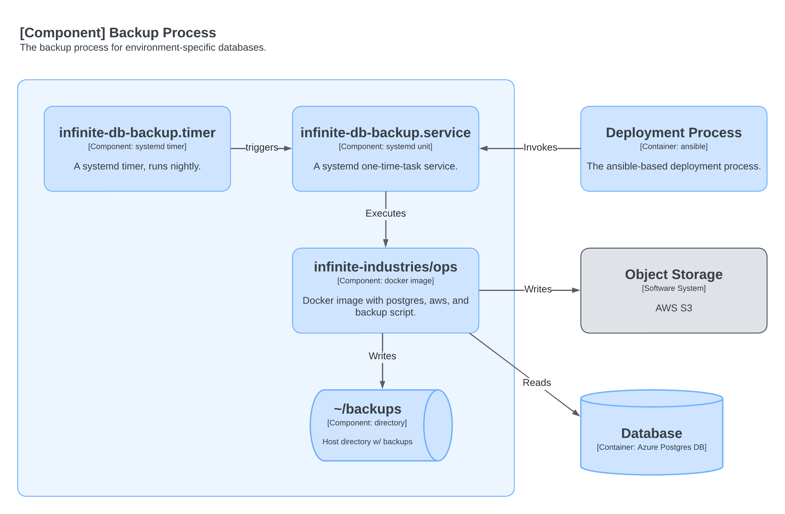

# Infinite Industries - Backup Process

* [Overview](#overview)
* [About the database](#about-the-database)
* [Creating a backup](#creating-a-backup)
* [Using the backups](#using-the-backups)
  * [Retrieving backups (ssh)](#retrieving-backups-ssh)
  * [Retrieving backups (S3)](#retrieving-backups-s3)
  * [Restoring backups (PSQL / CLI)](#restoring-backups-psql--cli)
  * [Restoring backups (Docker)](#restoring-backups-docker)
  * [Restoring a backup (Codespaces)](#restoring-a-backup-codespaces)
* [Details](#details)
  * [What are the different backup files?](#what-are-the-different-backup-files)
  * [Backup Retention](#backup-retention)
  * [The backup script](#the-backup-script)
  * [The ops docker image](#the-ops-docker-image)
  * [Systemd integration](#systemd-integration)
  * [Deployment integration](#deployment-integration)
  * [AWS (S3) configuration](#aws-s3-configuration)
  * [AWS (IAM) configuration](#aws-iam-configuration)
* [Future Work](#future-work)

## Overview
Every night, a backup of the database is created on the host and copies are
uploaded to S3.  The examples below refer to the production database
(*infinite-prod*), but similar files are available from staging
(*infinite-staging*).

* **Schedule**: nightly (and upon deployment)
* **Backup Files**:
    * `infinite-prod.dump`
    * `infinite-prod.gz`
    * `infinite-prod.anon.gz`
* **Host location**: `~/backups`
* **S3 location**: `s3://infinite-industries-backups/db/`



## About the database

The database is **Azure Database for PostgreSQL Single Server**. The instance
is shared by both staging and production environments. A schema exists for each
environment, like *infinite-prod* or *infinite-staging*.  A single role (user)
is defined for each environment which owns and has full access to all the
tables in the schema. This user is used for all operations against the
database. 

The database schema is created and managed by the Infinite Industries API
server.

## Creating a backup

**Using ansible**:
```
$ cd ansible
$ just backup
```

**From the host**:
```
$ sudo systemctl start infinite-db-backup
```

## Using the backups

*Note: the examples in this section refer to the production the anonymized
backups, `infinite-prod.anon.gz`.*

### Retrieving backups (ssh)

To retrieve the latest production backup from the host, run:
```bash
$ scp infinite.industries:backups/infinite-prod.anon.gz
```

### Retrieving backups (S3)

To retrieve the latest production backup from S3, run:
```bash
$ aws s3 cp s3://infinite-industries-backups/db/infinite-prod.anon.gz .
```

### Restoring backups (PSQL / CLI)
Native Postgres utilties provide the basis for restoring backups. 

This instruction assumes that a database role already exists - i.e. you can
connect to the database and create tables.

**Using psql** to restore to the *dbname* database.
```bash
$ zcat infinite-prod.anon.gz | psql dbname
```

**Using pg_restore** to restore to the *dbname* database.
```bash
$ gunzip infinite-prod.anon.gz
$ pg_restore --clean --if-exists --no-privileges --no-owner -v -d dbname infinite-prod.dump
```

### Restoring backups (Docker)

The official [postgres docker image](https://hub.docker.com/_/postgres) is an
ideal target to use for local development purposes. It includes functionality
to trivially populate database by including exported data as part of the
database initialization.

These commands will start a docker container with a database populated from the
backup.  The database name, user, and password are specified as environment
variables.

```bash
$ gunzip infinite-prod.anon.gz
$ docker run -p 5432:5432 -d --rm \
    -v ./infinite-prod.sql.latest:/docker-entrypoint-initdb.d/init.sql \
    -e POSTGRES_USER=infinite \
    -e POSTGRES_PASSWORD=xxx \
    -e POSTGRES_DB=infinite-local
    postgres:alpine
```

The database can now be accessed:
```bash
$ PGPASSWORD=xxx psql -h localhost -U infinite infinite-local
```

### Restoring a backup (Codespaces)

There are `just` recipes to fetch backups from S3 and to populate a local database. 
```bash
$ just fetchdb populatedb
```

## Details

### What are the different backup files?

There are three distinct backup files that are created as part of this process.

1. `infinite-prod.gz`. The output from
   [pg_dump](https://www.postgresql.org/docs/current/app-pgdump.html) in
   (compressed) plain-text SQL format. Excluded from this is ownership
   information (see the *--no-owner* flag) and GRANT/REVOKE info (see the
   *--no-acl* flag) to maximize portability. This can be used with
   [pg_restore](https://www.postgresql.org/docs/current/app-pgrestore.html) or
   [psql](https://www.postgresql.org/docs/current/app-psql.html). 

2. `infinite-prod.anon.gz`. This is a (compressed) plain-text SQL format dump
   where all email addresses have been anonymized to nobody@example.com. **This
   file is most often used by developers**.

3. `infinite-prod.dump`. The output from
   [pg_dump](https://www.postgresql.org/docs/current/app-pgdump.html) in
   Postgres custom archive format. It is potentially useful for legacy purposes
   or full database restores.

### Configuration and Deployment 

There is an ansible role, [db-backups](../ansible/db-backup), that is used to
deploy the backup process and to perform backups on-demand. Whenever services
are deployed using ansible, a backup is performed by default.

The role defines two tags which can be used to control usage.
1. `backup-setup` - deploys everything required to perform backups to the host.
   Config files, image, etc.
1. `backup` - trigger a backup.

In the sections below, links are made to files that are part of this role.

### Backup Retention

On the host, 10 days of backups are retained. This is controlled by the
`NUM_BACKUPS` variable and set along with others in
[ops.env](../ansible/db-backup/templates/ops.env.j2).

In S3, 45 non-current versions of every backup are retained; non-current
versions older than this are deleted. This is controlled via a lifecycle policy
on the S3 bucket.

### The `backup` script

Primary orchestration of the process is a single shell script,
[backup](../ops/ctx/backup), installed in `~/bin/backup`. It runs on the host,
but additionally relies on the tools that are installed in the *ops* Docker
image.

### The `ops` docker image

The backup process requires several command-line utilities, (including postgres
and AWS CLI) that were not readily available on the host. Additionally:
packages on the host are not actively managed and the service environment is
based on docker-compose.

The [ops](../ops/Dockerfile) image was created to address this need. 

* It includes requsite packages and the [backup] orchestration script.
* Standard postgres and AWS variables are expected by the script.
* Credentials are managed as part of the docker-compose environment - [ops.env](../ansible/db-backup/templates/ops.env.j2).
* It executes with a bind mounted directory containing backups- `/home/infinite/backups`.

### Systemd integration

Rather than using `cron`, scheduled execution of the process is performed by
systemd. Three factors were considered in choosing this mechanism:

1. There are no other cron jobs being actively managed, whereas other Infinite
   services make use of systemd.
2. In addition to running the backup process regularly, it was desirable to
   invoke a backup upon deployment.
3. The environment (role account, permissions, working directory, environment
   variables) are important to the backup process.

Encapsulating the invocation in a systemd unit addresses all of these concerns
more easily than using cron: both scheduled and on-demand execution are able to
use the same mechanism and no additional management techniques need to be
introduced.

The schedule for execution is defined in
[infinite-db-backup.timer](../ansible/db-backup/files/infinite-db-backup.timer).

### Deployment integration

The primary ansible playbook
[deploy_site_playbook](ansible/deploy_site_playbook.yml) includes the
`db-backup` role in order to setup and execute database backups.

### AWS (S3) configuration

S3 bucket: `infinite-industries-backups`
S3 lifecycle to delete old versions:
```bash
$ aws s3api get-bucket-lifecycle-configuration --bucket infinite-industries-backups
{
    "Rules": [{
            "ID": "delete old db backups",
            "Filter": {"Prefix": "db/"},
            "Status": "Enabled",
                "NoncurrentVersionExpiration": {
                    "NoncurrentDays": 1,
                    "NewerNoncurrentVersions": 45
                }
     }]
}
```

### AWS (IAM) configuration

Two policies are defined to control access to the S3 bucket:
`ro_infinite-industries_backups` provides read-only,
`rw_infinite-industries_backups` other provides read-write. 

A dedicated IAM user, `s3-backup`  exists to support backups.  The read-write
policy is attached to this account and permissions are otherwise limited.  This
account is used by production and staging systems to perform backups.

A second dedicated IAM user, `s3-backup-ro` exists to support read-only access
to backups. When Github organization (team) members instantiate Codespaces
environments, credentials for this user are suppplied to the environment. 

## Future Work

- Azure provides an automated backup functionality for Azure Postgres. Enable
  (and document) it.

- The read-only IAM account used to read backups should be renamed from
  `s3-backup-ro` to `github-codespaces` to indicate the environment which uses
  the account.
