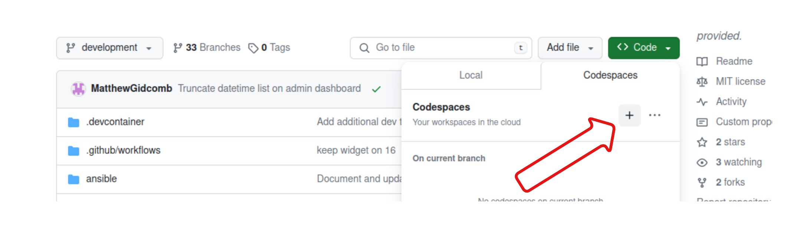
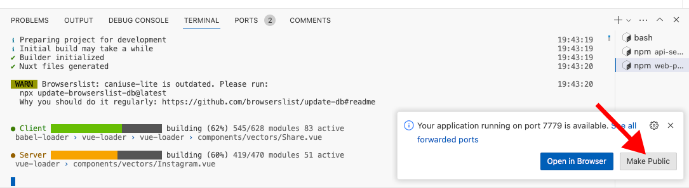
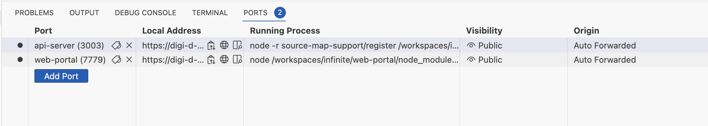
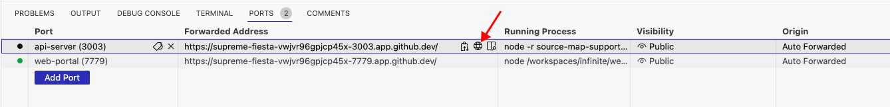
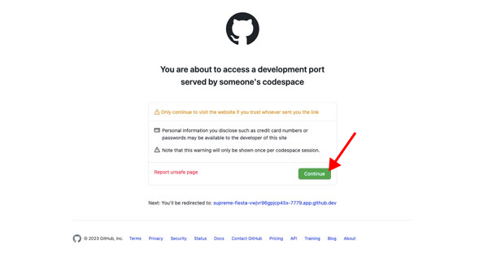

# Codespaces

## Quickstart

* [Create a codespace for the branch](#create-a-codespace-for-the-branch)
* [Wait for codespace to launch](#wait-for-codespace-to-launch)
* [Populate the database](#populate-the-database)
* [Making the web ports public](#making-the-web-ports-public)
* [Start the API service](#start-the-api-service)
* [Start the web portal](#start-the-web-portal)
* [Accessing the services](#accessing-the-services)

### Create a codespace for the branch


### Wait for codespace to launch
Wait for the codespace to launch and for project dependencies to be installed.

### Populate the database

The database is currently empty. An anonymized copy of the production database
has been downloaded as part of the codespace creation. To populate the
database, type the following in a terminal:

```console
just populatedb
```

### Making the web ports public

Codespaces makes web services available as they start.  The ports being used
must be publicly accessible in order to access the servives.

When services start, you will likely be prompted whether you want to make the
ports public. You do! 



You can also make ports public after the services start by navigating to the
*Ports* tab and updating the visibility of the port to "Public". 



### Start the API service
In a terminal, type:

```console
cd api-server
npm run start:dev
```

### Start the web portal
In a terminal, type:

```console
cd web-portal
npm run start:dev
```

### Accessing the services
In ports tab, click on web icon to go to the web frontend or API service



Click Continue to access the service 


